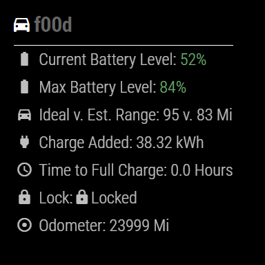

# MMM-TeslaFi

This an extension for the [MagicMirror](https://github.com/MichMich/MagicMirror).

## Screenshot



It monitors a your Tesla Stats, such as Battery Level, Temperature, Lock status and much more! A valid API key is required, the key can be requested here: https://teslafi.com

Big thanks to [aduyng](https://github.com/aduyng) for their [TeslaStatus](https://github.com/aduyng/MMM-TeslaStatus) module used as a template!

## Installation

Open a terminal session, navigate to your MagicMirror's `modules` folder and execute `git clone https://github.com/f00d4tehg0dz/MMM-TeslaFi.git`, a new folder called MMM-TeslaFi will be created.

Activate the module by adding it to the config.js file as shown below. Of course the position is up to you.

## Notes

* Some fields (charge added, time to full charge) are currently only enabled if the vehicle is plugged in

## Ongoing work

* Display Tesla on Google Maps

## Using the module

````javascript
modules: [
		{
			module:	'MMM-TeslaFi',
			position:	'top_left',
			config: {
				apiKey: 'ENTER YOUR KEY HERE',
			}
		},
````
